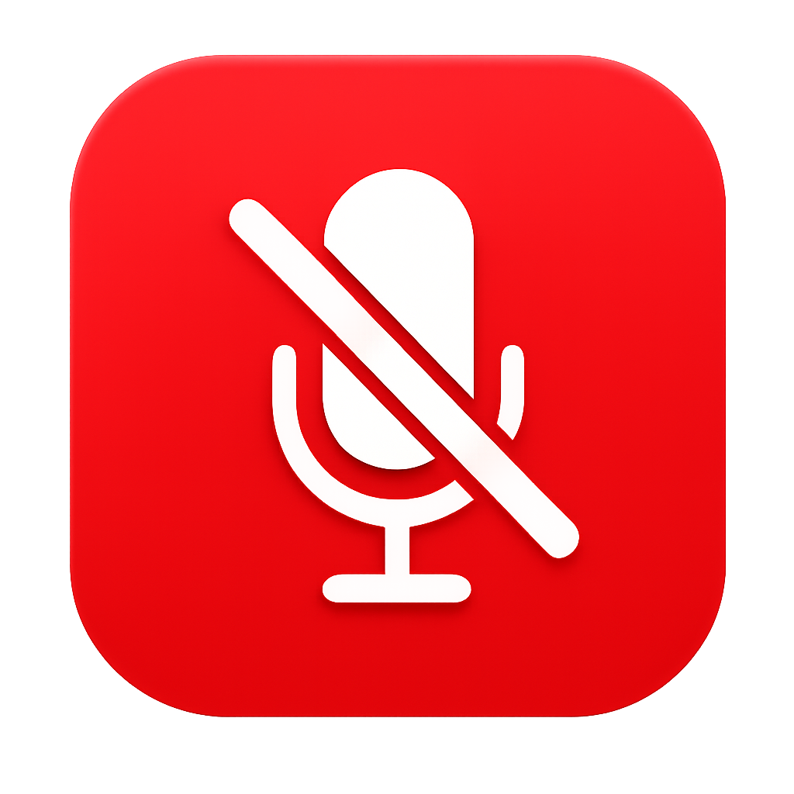

# 🎙️ Microphone Muter

**The simplest way to mute your microphone in one click!**

---

## ✨ Features

- 🎯 **Always On Top** – Stays visible on your screen at all times
- 🖱️ **Draggable** – Move it anywhere you want
- ⚡ **Lightweight** – Uses minimal system resources
- 😊 **Simple & User-Friendly** – Beautiful big button interface, no confusing menus
- 🔑 **Customizable Hotkey** – Set your own keyboard shortcut (default: Ctrl+M)

---

## 🚀 Quick Start

### Installation

1. Download `Microphone Muter.exe` from the [Releases](../../releases) page
2. Run the executable (right-click → **Run as administrator**)
3. Done! 🎉

### Usage

**Click the button** to toggle mute on/off:
- 🔴 **Red** = Microphone is muted
- 🟢 **Green** = Microphone is active

**Use keyboard shortcut** (default: `Ctrl+M`) to mute/unmute instantly

---

## ⚙️ Customize Hotkey

1. Right-click the button
2. Select **"Change Hotkey"**
3. Click **"🎙️ Record Hotkey"** and press your desired keys
   - Examples: `Ctrl+M`, `Alt+F13`, `Shift+J`
4. Click **"✓ Apply"**

That's it! Your new hotkey is saved.

---

## 💾 System Requirements

- **Windows 10 or 11**
- **Administrator rights** (to control microphone)
- **Any microphone device** (USB, 3.5mm, built-in, etc.)

---

## 🎯 Why You'll Love It

✅ No installation needed – just run the .exe  
✅ Super lightweight – won't slow down your system  
✅ Always visible – never miss a mute opportunity  
✅ Move it around – place it wherever you want  
✅ Your hotkey – customize it to match your workflow  

---

## 🐛 Troubleshooting

**The app won't start?**
- Right-click → Run as administrator

**Microphone won't mute?**
- Close other audio apps that might be controlling your mic
- Check Windows Sound Settings for any conflicts

**Hotkey not working?**
- Make sure the hotkey isn't already used by another program
- Try a different key combination

---

## 📝 License

This software is provided as-is for personal use.

---

**Enjoy muting! 🔇**
- You can combine: `ctrl+shift+m`, `alt+shift+f13`, etc.

## Troubleshooting

### App won't start
- Make sure Python and all dependencies are installed
- Run Command Prompt as Administrator

### Microphone toggle doesn't work
- Ensure the app is running with Administrator privileges
- Check if your microphone is recognized by Windows

### Hotkey doesn't work
- The app needs to run with Administrator privileges for global hotkeys
- Try a different key combination
- Make sure the hotkey isn't already used by another application

## Running as Admin

For best results (especially for global hotkeys), run as Administrator:
1. Right-click the .exe file
2. Select "Run as administrator"

## Notes

- The default hotkey is **Ctrl+M**
- Keep the app window open for hotkey functionality
- The app automatically detects your default microphone
- The button color changes based on mute state (bright red = on, dark red = off)

## License

This application is provided as-is for personal use.
